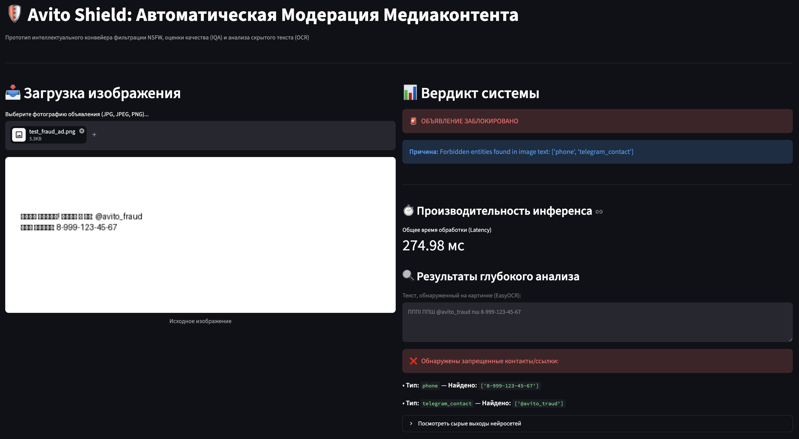

# Avito Shield: Мультимодальный конвейер автоматической модерации объявлений
> 💡 **Pet-Project статус:** Данный проект является независимой учебной разработкой, вдохновленной архитектурными вызовами модерации контента в классифайде **Авито**. Проект создан с целью демонстрации навыков проектирования асинхронных ML-сервисов, оптимизации инференса моделей и обеспечения высокой отказоустойчивости (High Load MVP).

Высокопроизводительный асинхронный сервис на стыке **Computer Vision**, **NLP** и **Production Engineering**, разработанный с учетом специфики обработки больших потоков данных (High Load) в классифайдах уровня Авито.

Сервис решает критическую проблему платформы — автоматическое обнаружение мошенничества, скрытых контактов перекупщиков на изображениях (параллельный обход модерации) и фильтрацию некачественного контента.

## 📸 Демонстрация работы интерфейса



# Avito Shield: Прототип асинхронного конвейера модерации объявлений

> 💡 **Pet-Project статус:** Данный проект является независимой учебной разработкой, вдохновленной архитектурными вызовами модерации контента в классифайде **Авито**. Цель проекта — спроектировать легковесное MVP для асинхронного анализа медиаконтента, продемонстрировать навыки работы с CV/NLP пайплайнами и заложить базу для масштабирования в распределенную систему.

---

## 🏗 Архитектура системы и компромиссы MVP

В рамках текущего прототипа реализована **каскадная (short-circuit) логика** обработки запроса на FastAPI для снижения вычислительной нагрузки:
1. **NSFW Экспресс-фильтр** (ONNX заглушка) — концепт раннего отсечения жестких нарушений до запуска тяжелых вычислений.
2. **IQA (Image Quality Assessment) Модуль** — оценка качества фото для формирования рекомендаций пользователю.
3. **OCR Движок (EasyOCR)** + **Текстовые фильтры (RegEx)** — извлечение текста с изображения и детектирование базовых паттернов увода пользователей в сторонние мессенджеры (Telegram, контакты).

### ⚡ Инженерные ограничения и Production-дизайн (Scoping):
* **Отсутствие очередей задач (Celery/RabbitMQ/Kafka):** В рамках MVP инференс моделей выполняется в рамках ASGI-событий FastAPI. Для полноценного Production-решения уровня Авито данная архитектура обязана быть переработана на **event-driven подход**: FastAPI принимает файл, сохраняет его в S3-совместимое хранилище, отправляет событие в Kafka, а пул воркеров (на Triton Inference Server или Celery) асинхронно разбирает задачи, чтобы не блокировать Event Loop и предотвратить OOM.
* **EasyOCR vs PaddleOCR:** В текущей кодовой базе движок OCR стандартизирован под **EasyOCR** (PyTorch) в силу его нативной кроссплатформенной совместимости (включая стабильный запуск на Apple Silicon/CPU локально). Названия полей в UI синхронизированы с бэкендом.
* **RegEx vs NLP/NER:** В качестве базового фильтра используются регулярные выражения. Осознавая их уязвимость перед обфускацией (например, *"8_девять_один_6..."*), в архитектуру заложена модульность для бесшовной замены RegEx на легковесную NER-модель (Named Entity Recognition) или эмбеддинги предложений для семантического поиска фрода.

---

## 📊 Технические метрики (Бенчмарк CPU локально)
* **Средний Latency пайплайна:** ~300–350 мс (включая полный инференс EasyOCR для извлечения текста на CPU Apple Silicon).
* **Мгновенное отсечение:** < 10 мс при срабатывании первичных фильтров.

---

## 📸 Демонстрация работы


---

## 🚀 Быстрый запуск (Локально)

### 1. Склонируйте репозиторий и поднимите окружение:
```bash
git clone [https://github.com/ekrtg25/avito-media-moderator.git](https://github.com/ekrtg25/avito-media-moderator.git)
cd avito-media-moderator
python3 -m venv .venv
source .venv/bin/activate
PYO3_USE_ABI3_FORWARD_COMPATIBILITY=1 pip install -r requirements.txt